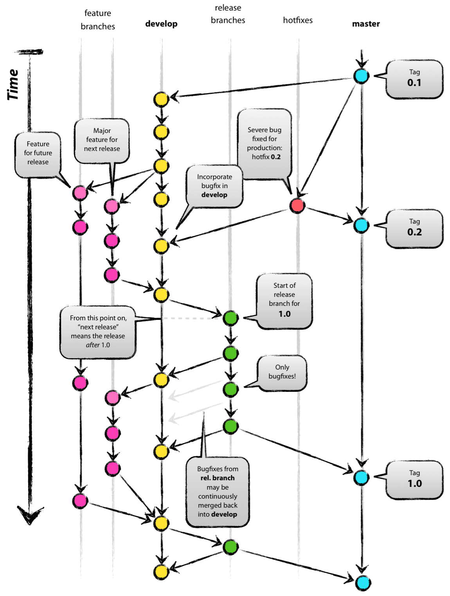

# Git

Dùng để quản lý code



2 nhánh master và develop: không nên chỉnh sửa code trực tiếp trên 2 nhánh này.

nhánh feature branches: thường được đặt tên theo chức năng của project, nhánh này được tạo ra từ nhánh develop, tất cả sự thay đổi ở đây sẽ được add và push lên nhánh develop, khi đó sẽ có người review code và merged. 

để tạo nhánh mới dùng:

```
git branch <tên nhánh muốn tạo>

vd:

git branch develop
```

để kiểm tra có nhánh nào dùng:

```
git branch
```

để di chuyển giữa các nhánh dùng:

```
git checkout <tên nhánh>

vd:

git checkout develop
```

tạo nhánh feature branches từ nhánh develop dùng:

```
git checkout -b <tên nhánh mới> <tên nhánh mà bạn muốn bắt đầu nhánh mới>

vd:

git checkout -b <feature-branches> <develop>
```

để kiểm tra trạng thái của thay đổi file dùng:

```
git status
```

để ghi nhận sự thay đổi của file dùng:
```
git add .

hoặc

git add <tên file chức năng>
```

để tạo ra một commit với một message dùng:
```
git commit -m '#4 - add file product'

#4 - add file product'

mẫu tin nhắn này thường được sử dụng trong quy trình kiểm soát và quản lý công việc phân phối(issue tracking)
```


dùng để xóa nhánh ở local dùng:
```
git branch -d feature-branches
```
để xóa nhánh remote (là xóa ở github) dùng:
```
git push origin -d feature-branches
```
để gắn tag cho các commit, là một cách để đánh dấu phiên bản dùng:
```
git tag 'v1.1.0'

xong

git push
```
